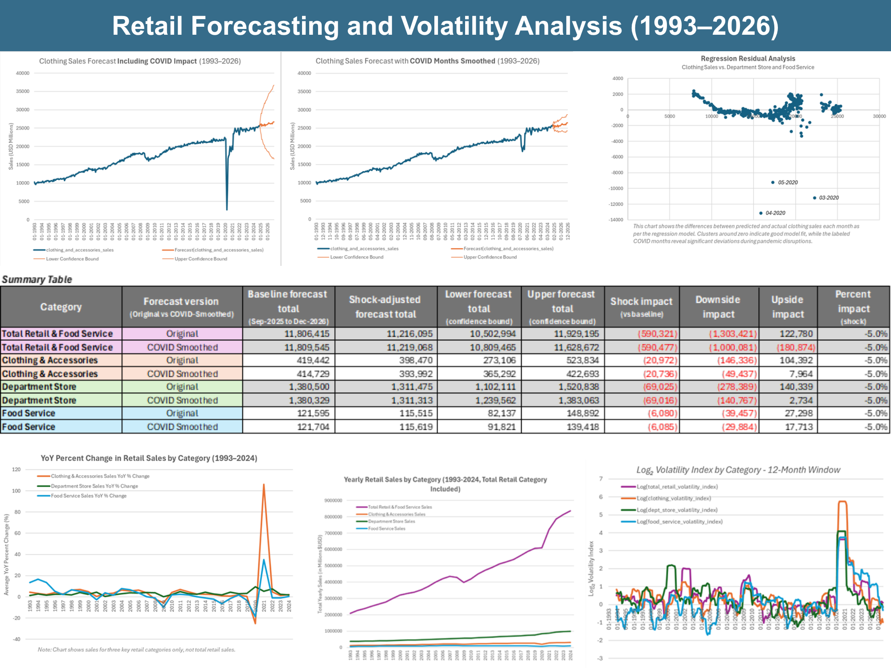

# Industry-Level Forecasting and Volatility Analysis  
**Assessing Retail Sector Stability and Forecast Risk for Nationwide Apparel Retailer Inc.**  

**Author:** James Gifford  
**Date:** October 2025  

---

## 🧩 Overview  

This project analyzes U.S. retail and food service sales trends using publicly available data from the U.S. Census Monthly Retail Trade Survey (MRTS).  
It evaluates volatility, forecast accuracy, and supply/demand shock sensitivity,  with a focus on the **Clothing & Accessories** sector.  

The analysis combines **PostgreSQL** (for data preparation) and **Excel** (for forecasting, volatility indices, and scenario modeling).  

---

## 📊 Deliverables  
| File | Description |
|------|--------------|
| **Industry_Level_Forecasting_and_Volatility_Analysis.pdf** | Full professional report with methodology, figures, and business insights |
| **Industry_Level_Forecasting_and_Volatility_Analysis.xlsx** | Interactive Excel model including forecasts, volatility indices, and scenario calculator |
| **01_Output_for_Excel_Analysis.sql** | SQL script for merging raw MRTS series and generating MoM/YoY growth calculations |
| **02_Sales_MoM_Change_Flagging.sql** | SQL script identifying significant monthly sales swings (>5%) as early EDA |
| **combined_retail_sales.csv** | Combined raw dataset (FRED MRTS series) |
| **SQL_Output_for_Excel_Analysis.csv** | Cleaned dataset exported from SQL for use in Excel modeling |

---

## 🔍 Key Insights  
- Clothing & Accessories is the most disruption-sensitive category, with volatility exceeding 50× its baseline during the pandemic.
- Data smoothing clarifies underlying demand trends and produces more stable, realistic forecasts across all sectors.
- Volatility indices reveal how short-term shocks differ from long-term uncertainty, offering a clearer view of recovery timing.
- Scenario modeling shows that even modest (5–10%) supply or demand constraints can significantly impact total revenue potential.

---

## 🧠 Business Value  
This framework enables **data-driven decision-making** by quantifying operational risk, improving forecast accuracy,  
and identifying volatility signals that inform inventory, sourcing, and marketing strategies.  

---

*(Full results, visuals, and recommendations are available in the PDF report. The interactive Scenario Calculator and complete forecast tables are included in the accompanying Excel workbook.)*